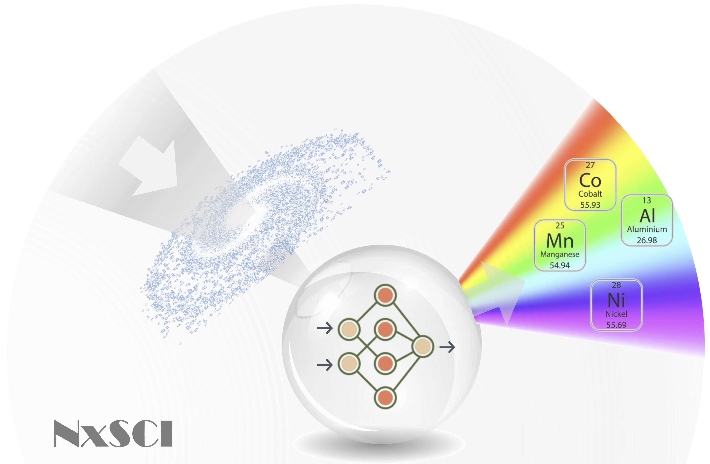
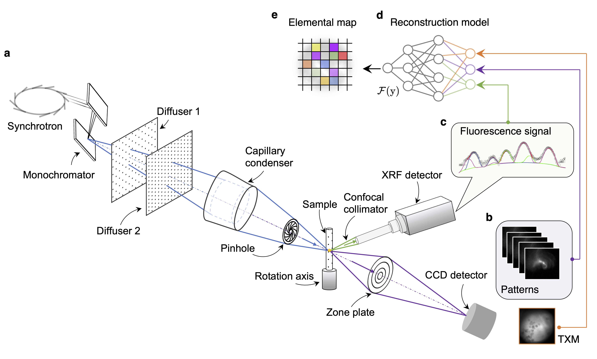
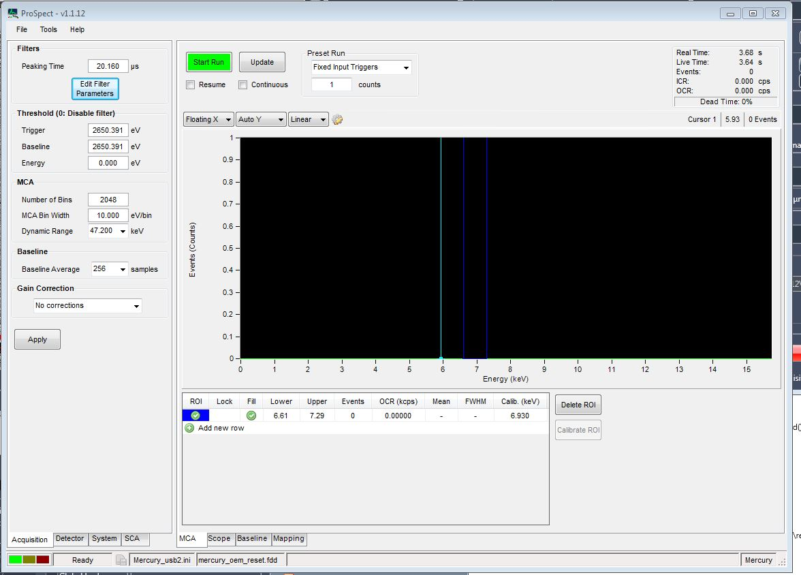
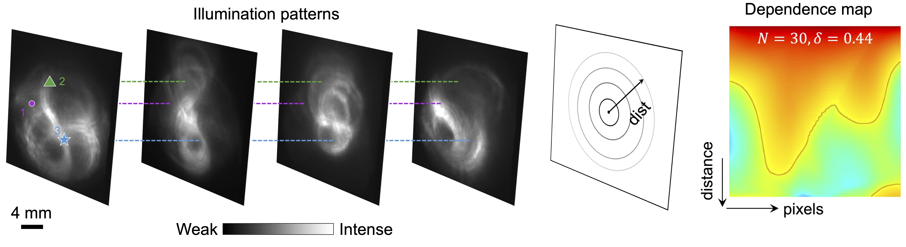
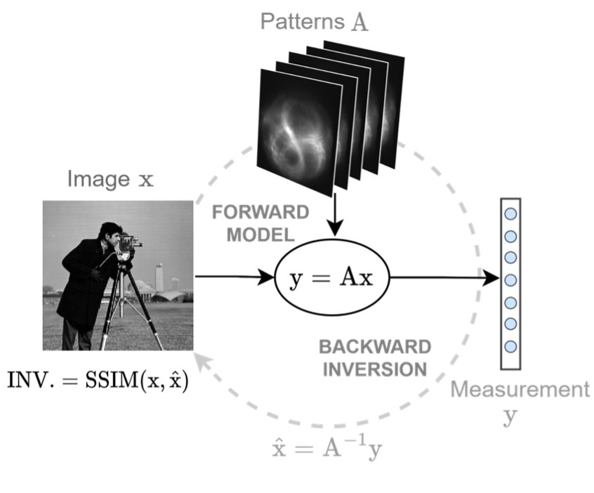
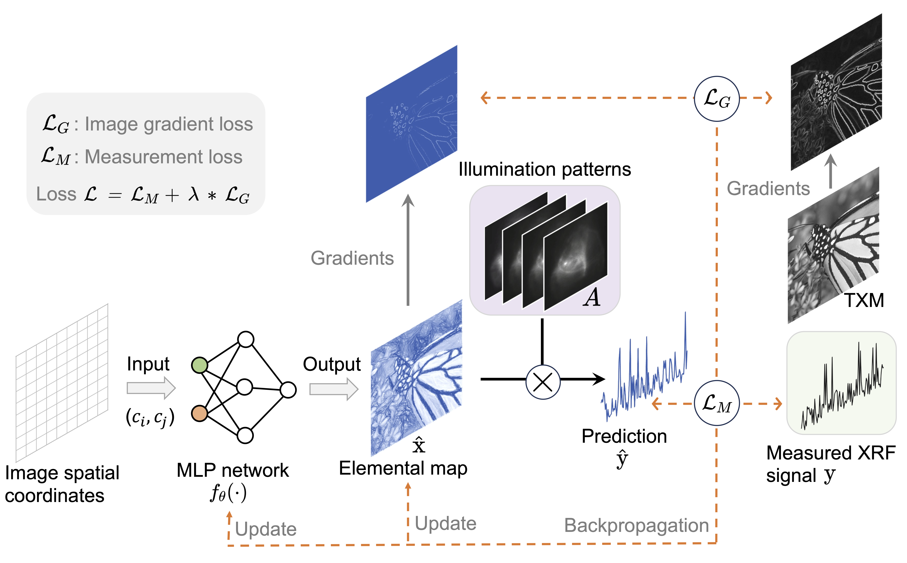
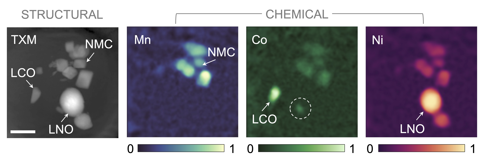

<!-- PROJECT LOGO -->
<br />
<div align="center">
  <a href="https://github.com/YijinLiu-Lab/NxSCI">
    
  </a>

  <h3 align="center">Nanoscale Chemical Imaging with Structured X-ray Illumination</h3>

  <p align="center">
    Integrating the full-field transmission X-ray microscope with an X-ray fluorescence detector, eliminating nanoscale X-ray focusing and raster scanning for chemical element mapping.
    <br />
    <a href="#about-the-project"><strong>System overview »</strong></a>
    <br />
    <br />
    <a href="https://github.com/othneildrew/Best-README-Template">Hardware implementation</a>
    ·
    <a href="https://github.com/othneildrew/Best-README-Template/issues">Software development</a>
    ·
    <a href="https://github.com/othneildrew/Best-README-Template/issues">Battery example</a>
  </p>
</div>

<!--
[](DOIlink)
-->

This repository contains the source codes for the nanoscale X-ray structured-illumination chemical imaging technique (NxSCI), as described in the following paper:

```
@journal{li2023NxSCI,
  title={Nanoscale chemical imaging with structured X-ray illumination},
  author={Li, Jizhou and Chen, Si and Ratner, Daniel and Blu, Thierry and Pianetta, Piero and Liu, Yijin},
  year={2023},
  journal={Submitted}
}
```

<!-- ABOUT THE PROJECT -->
## System Overview

<p align = "center">
</p><br align = "left">
Experimental setup and operation principle. (<b>a</b>) Two sandpaper diffusers are inserted into the X-ray beam to modulate the illumination structures. (<b>b</b>) The corresponding patterns are recorded by a full-field imaging detector downstream of the objective zone plate. (<b>c</b>) A Vortex XRF detector is used to collect the fluorescence signal on-the-fly. (<b>d</b>) The 1D fluorescence signal and 2D X-ray illumination patterns are fed into an image reconstruction model to obtain the chemical elemental maps in (<b>e</b>).
</p>


<!-- ABOUT THE PROJECT -->
## Hardware Implementation

### Experimental setup

<p align = "center">
</p><p align = "left">
The modified TXM experimental setup on <a href="https://www-ssrl.slac.stanford.edu/content/beam-lines/bl6-2c">beam line 6-2c</a> at <a href="https://www-ssrl.slac.stanford.edu">SSRL</a>. Two sandpaper stages with different grit sizes are inserted into the beam in the second hutch. An energy dispersive Vortex detector is placed perpendicular to the incident beam between condenser (CD) and zoneplate (ZP) to collect the fluorescence signal from the sample. The position of the Vortex detectors is controlled by a motor to collect the strongest XRF signal. 
</p>

More details about the synchrotron beamline configuration can be found in [F. Meirer et al. 2011](https://www.ncbi.nlm.nih.gov/pmc/articles/PMC3161818/).

### Hardware control

Customized scripts are developed on the top of [XMFlex](https://www-ssrl.slac.stanford.edu/txm/sites/default/files/documents/xmflex_manual_20140226.pdf) ([Liu et al. 2012](https://www.ncbi.nlm.nih.gov/pmc/articles/PMC3284347/))  and integrated into [SPEC](https://certif.com/spec.html) to control the movements of motors, beamline settings, TXM image capturing and XRF signal collection sequentially. 

The signal collection through Vortex detector is performed by the [XIA LLC](https://xia.com/)'s [ProSpect](https://github.com/xiallc/ProSpect) V1.1 software.

All spectra are analyzed by the software [PyMCA](http://www.silx.org/doc/PyMca/dev/index.html), developed by [European Synchrotron Radiation Facility (ESRF)](https://www.esrf.fr/). 

The code snippets for the motor control and data collection can be found in [control.py](Hardware/control.py)

The configuration file of ProSpect is available [here](Hardware/mercury_20210305.ini), and a screenshot of the parameters used is shown below.

<p align = "center">
</p><p align = "center">
Parameter setting of ProSpect for the XRF collection.
</p>

### Examples of Illumination Patterns


<p align = "center">


</p><p align = "center">
Examples of the experimental acquired illumination patterns (fine controlled).
</p>


<!-- ABOUT THE PROJECT -->
## Software Development
This part includes [Illumination Pattern Evaluation](#Illumination-Pattern-Evaluation) and Generative Image Reconstruction model. 

### Illumination Pattern Evaluation

The quality of an illumination pattern set is critical to ensuring that the sample’s morphological and chemical details across different length scales are sufficiently captured.

We define the independence map by calculating the Pearson correlation coefficients among different pixels in the field of view (FOV). For a certain target pixel, we sort all the other pixels in the FOV based on their respective distances to the target. This approach converts the calculated real-space map of the Pearson correlation coefficient into a vector. After iterating this process for all the pixels in the FOV, we construct a two-dimensional independence map in which the horizontal axis is the index of the target pixel, and each column represents the target’s Pearson correlation coefficient vector.

<p align = "center">
</p><p align = "center">
Analysis of the structured illumination patterns. Representative examples of the illumination patterns, which are generated by the effective modulation of the X-ray imaging setup. 
</p>

We further define the invertibility as an indicator to evaluate the impact of illumination patterns on the reconstruction process.

<p align = "center">
</p><p align = "center">
Definition of the invertibility of the illumination pattern set.
</p>

The [Matlab](https://www.mathworks.com/products/matlab.html) codes to calculate the depedence and invertibility can be found in the [folder](Software).


### Generative Image Reconstruction

- We propose a __self-supervised generative approach__ to obtain the continuous representation of the elemental maps to solve this inverse problem. 

- We leverage the __implicit neural representation__ to parameterize the spatial coordinates, effectively mapping the image. 

- Due to the ill-posedness of this problem, we leverage __prior knowledge from the TXM image__ in the NxSCI setting and incorporate it into our cost function as a regularization term. 


<p align = "center">
</p><p align = "center">
Schematic illustration of the proposed reconstruction model. 
</p>


The [PyTorch](https://pytorch.org/) codes to reconstruct the chemical map can be found in the [folder](Software).


<!-- ABOUT THE PROJECT -->
## Battery Example

As a proof-of-concept demonstration, we apply the developed NxSCI technique to image a battery sample with mixed cathode particles. 

The imaged battery sample consists of three types of cathode particles, LiNi<sub>0.7</sub>Mn<sub>0.2</sub>Co<sub>0.1</sub>O<sub>2</sub> (NMC), LiCoO<sub>2</sub> (LCO) and LiNiO<sub>2</sub> (LNO). 


<p align = "center">
</p><p align = "center">
Reconstruction of elemental distribution in a lithium battery sample with mixed cathode material. 
</p>

## Conclusion

- We present a nanoscale chemical X-ray imaging technique that employs structured illumination to enable high-resolution, high-efficiency, spatially resolved mapping of elemental distributions within a sample. 

- By jointly optimizing the illumination scheme and the image reconstruction model, the developed NxSCI approach overcomes the limitations of traditional time-consuming XRF point scanning probes. 
